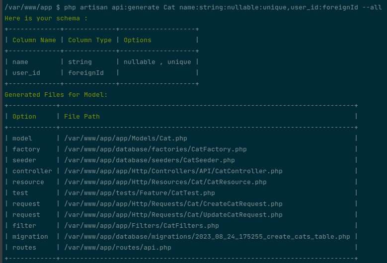

<h1><center> Laravel API tool kit</center></h1>

<p align="center">
    
</p>

[](https://packagist.org/packages/essa/api-tool-kit)

[](https://packagist.org/packages/essa/api-tool-kit)

## Introduction
Elevate your development journey with high-performance APIs using the API Toolkit. Supercharge your API development with standardized responses, dynamic pagination, advanced filtering, and a one-click full CRUD setup. Let's take your APIs to the next level!
## Installation
to install the package using Composer:
```
composer require essa/api-tool-kit
```
## Why Choose the Laravel API Toolkit?

### Consistent Responses, Less Hassle
The API Response feature simplifies generating consistent JSON responses. It provides a standardized format for your api responses:
```json
{
  "message": "your resource successfully",
  "data": [
    ...
  ]
}
```
### Pagination Done Right
Don't fuss over managing the number of results per page. The dynamic pagination feature adapts effortlessly to your needs, giving you control without complications.

```php
$users = User::dynamicPaginate();
```
### Simplified Filtering
Refine query results with simplicity. The powerful filtering system lets you filter, sort, search, and even include relationships with ease.

```php
Car::useFilters()->get();
```
### Simplify API Setup with the API Generator

The API Generator automates file setup, creating key files from migrations to controllers. Use one command to kickstart your API development.
```
php artisan api:generate ModelName --all
```
#### Schema Support
Enhance the API Generator with schema support, allowing you to define your database table structure directly from the command line. Generate factory model migrations, requests, and data based on this schema.

```
php artisan api:generate ModelName "column1:string|column2:integer|column3:datetime"
```

<p align="center">
    
</p>

### Logic Made Clear
Tackle complex business logic with Actions. These gems follow the command pattern, boosting readability and maintenance for your code.

```php
app(CreateCar::class)->execute($data);
```

### Media? Handled.
Handle file uploads and deletions like a pro. The Media Helper streamlines media management, leaving you with clean and organized file handling.
```php
$filePath = MediaHelper::uploadFile($file, $path);
```
### Enums for Clarity
The Enum class provides a way to work with enumerations, eliminating hardcoded values in your code:
```php
namespace App\Enums;

class UserTypes extends Enum
{
    public const ADMIN = 'admin';
    public const STUDENT = 'student';
}
```

## Official Documentation
Access our documentation to unlock the full potential of the Laravel API Toolkit:

[Explore the Documentation](https://laravelapitoolkit.com/)

## Contributing
We welcome your contributions to help make this package even better. Please refer to our [CONTRIBUTING.md](CONTRIBUTING.md) file for contribution guidelines.

## License

By contributing to the Laravel API Toolkit, you agree that your contributions will be licensed under the project's [MIT License](LICENSE.md).
