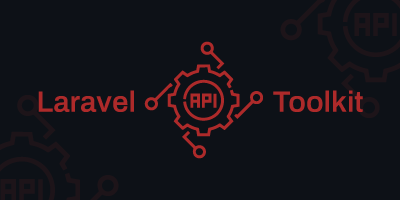
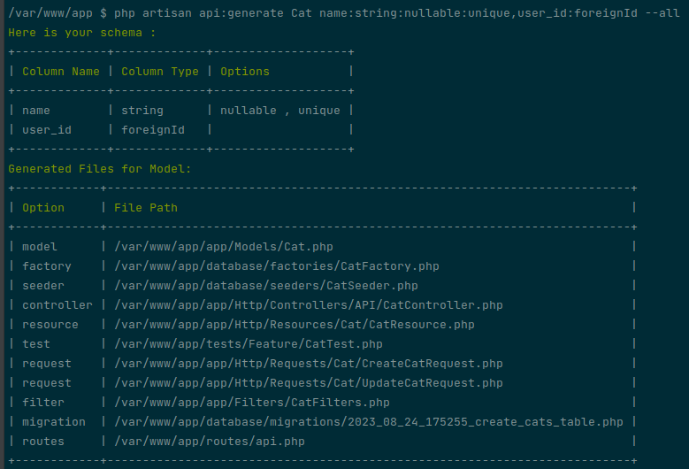

<h1><center> Laravel API tool kit</center></h1>

<p align="center">
    
</p>

[](https://packagist.org/packages/essa/api-tool-kit)

[](https://packagist.org/packages/essa/api-tool-kit)

## Introduction

Build production-grade Laravel APIs with standardized responses, dynamic pagination, advanced filtering, and **built-in AI architectural rules** that teach your coding assistant to follow your standards from the first draft.

## Installation

```bash
composer require essa/api-tool-kit
```

## 🤖 AI Skill — Teach Your AI Assistant Your Architecture

Ship production-grade APIs faster by giving your AI coding assistant a shared understanding of your architecture. One command installs **21 rule files** and **8 guided workflows** that ensure every AI-generated file fits your codebase from the first draft — no manual corrections needed.

Supports **Claude Code**, **Cursor**, **GitHub Copilot**, and **Antigravity**.

**Full experience** — slash commands, auto-loaded rules, per-tool native configuration:

```bash
php artisan api-skill:install [tool]
```

Supported tools: `claude`, `cursor`, `copilot`, `antigravity`. The installer copies rules and workflows to the correct location for your tool — e.g. `/investigate`, `/code-review`, `/new-endpoint` become real slash commands in Claude Code.

**Quick setup via Laravel Boost** — agent-agnostic, works with all AI tools:

```bash
php artisan boost:add-skill ahmedesa/laravel-api-tool-kit
```

Installs to `.ai/skills/laravel-api-tool-kit/` — a universal location Claude Code, Cursor, Copilot, Antigravity, and Gemini all read from on demand. No slash commands, but zero configuration.

> [!TIP]
> In non-interactive environments (Docker/CI), bypass the selection prompt with:
> `php artisan boost:add-skill ahmedesa/laravel-api-tool-kit --skill=laravel-api-tool-kit`

### What's included

| Category | Contents |
|----------|----------|
| **Rules** | Controllers, Models, Actions, DTOs, Services, Repositories, Filters, Enums, Events, Requests, Resources, Responses, Exceptions, Authorization, Testing, Database, Pagination, Anti-patterns, Code Quality, DDD, Dependency Injection |
| **Workflows** | New endpoint, add filtering, code review, investigate, curl-test, organize knowledge, update knowledge, create workflow |
| **DDD Support** | Works with both standard Laravel and Domain-Driven Design layouts |
| **Project Defaults** | Configure primary key type, auth guard, and test base class once — the AI applies them everywhere |

> [!TIP]
> The AI Skill is the recommended way to generate code for projects using this package. It replaces the need for scaffolding generators by teaching your AI assistant the full architecture.

[Read the full AI Skill documentation →](https://laravelapitoolkit.com/#/ai-skill)

---

## Why Choose the Laravel API Toolkit?

### 🤖 Built for AI-Assisted Development
The built-in AI Skill teaches your coding assistant to generate code that follows your architecture out of the box — no more fixing AI output to match your standards.

### Consistent Responses, Less Hassle
The API Response feature simplifies generating consistent JSON responses. It provides a standardized format for your API responses:
```json
{
  "message": "your resource successfully",
  "data": [
    ...
  ]
}
```

### Pagination Done Right
Don't fuss over managing the number of results per page. The dynamic pagination feature adapts effortlessly to your needs, giving you control without complications.

```php
$users = User::dynamicPaginate();
```

### Simplified Filtering
Refine query results with simplicity. The powerful filtering system lets you filter, sort, search, and even include relationships with ease.

```php
Car::useFilters()->get();
```

### Logic Made Clear
Tackle complex business logic with Actions. These gems follow the command pattern, boosting readability and maintenance for your code.

```php
class CarController extends Controller
{
    public function __construct(
        private readonly CreateCarAction $createCar,
    ) {}

    public function store(CreateCarRequest $request): JsonResponse
    {
        $car = $this->createCar->execute($request->validated());
        return $this->responseCreated(trans('car.created'), new CarResource($car));
    }
}
```

### Media? Handled.
Handle file uploads and deletions like a pro. The Media Helper streamlines media management, leaving you with clean and organized file handling.
```php
$filePath = MediaHelper::uploadFile($file, $path);
```

### Enums for Clarity
The Enum class provides a way to work with enumerations, eliminating hardcoded values in your code:
```php
enum UserType: string
{
    case ADMIN = 'admin';
    case STUDENT = 'student';
}
```

---

### API Generator

The API Generator automates file setup, creating key files from migrations to controllers. Use one command to kickstart your API development.

> [!NOTE]
> For AI-assisted development, the [AI Skill](#-ai-skill--teach-your-ai-assistant-your-architecture) is the recommended approach. It teaches your AI assistant the full architecture so generated code fits your project from the start. The API Generator remains available for developers who prefer traditional scaffolding.

```bash
php artisan api:generate ModelName --all
```

<p align="center">
    
</p>

## :film_strip: Video Tour
If you'd prefer a more visual review of this package, please watch this video on Laravel Package Tutorial.

[](https://youtu.be/lZ9PPW-5utw)

## Official Documentation
Access our documentation to unlock the full potential of the Laravel API Toolkit:

[Explore the Documentation](https://laravelapitoolkit.com/)

## Contributing
We welcome your contributions to help make this package even better. Please refer to our [CONTRIBUTING.md](CONTRIBUTING.md) file for contribution guidelines.

## License

By contributing to the Laravel API Toolkit, you agree that your contributions will be licensed under the project's [MIT License](LICENSE.md).
